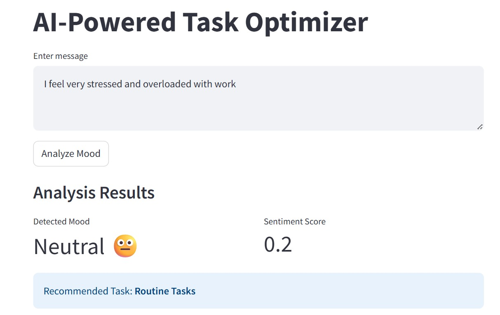
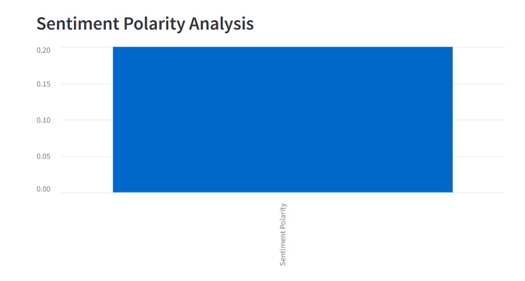
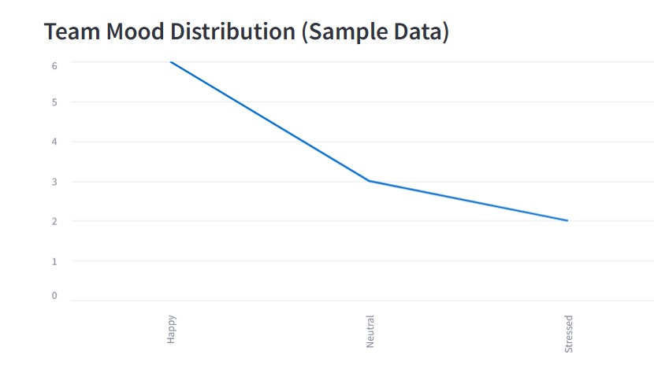

# Amdox AI-Powered Task Optimizer

This project analyzes employee mood using text-based emotion detection
and recommends suitable tasks.

## Features
- Emotion detection from text
- Task recommendation based on mood
- Stress alert simulation
- Simple Streamlit UI

## How to Run
pip install -r requirements.txt
streamlit run app.py

<<<<<<< HEAD
=======
## Project Screenshots

>>>>>>> a42cfb8275febfd71ace8dccdc1a059d0ad20d9e

